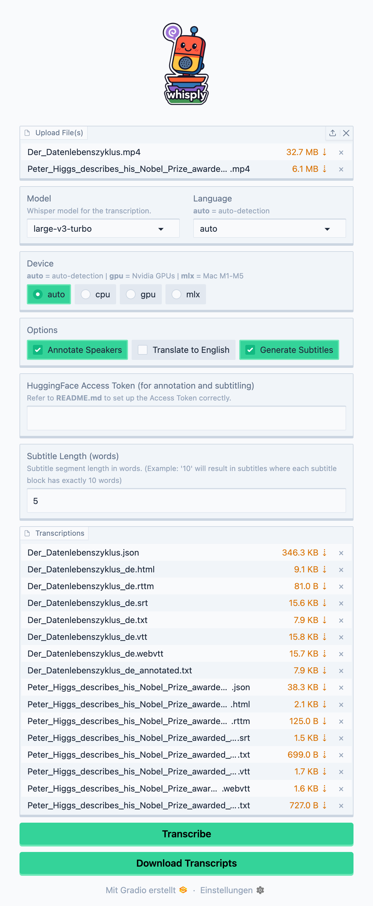

# whisply

[](https://badge.fury.io/py/whisply)


*Transcribe, translate, annotate and subtitle audio and video files with OpenAI's [Whisper](https://github.com/openai/whisper) ... fast!*

`whisply` combines [faster-whisper](https://github.com/SYSTRAN/faster-whisper) and [insanely-fast-whisper](https://github.com/Vaibhavs10/insanely-fast-whisper) to offer an easy-to-use solution for batch processing files on Windows, Linux and Mac. It also enables word-level speaker annotation by integrating [whisperX](https://github.com/m-bain/whisperX) and [pyannote](https://github.com/pyannote/pyannote-audio).

## Table of contents

- [Features](#features)
- [Requirements](#requirements)
- [Installation](#installation)
  - [Install `ffmpeg`](#install-ffmpeg)
  - [Installation with `pip`](#installation-with-pip)
  - [Installation from `source`](#installation-from-source)
  - [Nvidia GPU fix for Linux users (November 2025)](#nvidia-gpu-fix-november-2025)
- [Usage](#usage)
  - [CLI](#cli)
  - [App](#app)
  - [Speaker annotation and diarization](#speaker-annotation-and-diarization)
    - [Requirements](#requirements-1)
    - [How speaker annotation works](#how-speaker-annotation-works)
  - [Post correction](#post-correction)
  - [Batch processing](#batch-processing)
    - [Using config files for batch processing](#using-config-files-for-batch-processing)
- [Citation](#citation)

## Features

* 🚴‍♂️ **Performance**: `whisply` selects the fastest Whisper implementation based on your hardware:
  * CPU/GPU (Nvidia CUDA): `fast-whisper` or `whisperX`
  * MPS (Apple M1-M4): `insanely-fast-whisper`

* ⏩ **large-v3-turbo Ready**: Support for [whisper-large-v3-turbo](https://huggingface.co/openai/whisper-large-v3-turbo) on all devices. **Note**: Subtitling and annotations on CPU/GPU use `whisperX` for accurate timestamps, but `whisper-large-v3-turbo` isn’t currently available for `whisperX`.

* ✅ **Auto Device Selection**: `whisply` automatically chooses `faster-whisper` (CPU) or `insanely-fast-whisper` (MPS, Nvidia GPUs) for transcription and translation unless a specific `--device` option is passed.

* 🗣️ **Word-level Annotations**: Enabling `--subtitle` or `--annotate` uses `whisperX` or `insanely-fast-whisper` for word segmentation and speaker annotations. `whisply` approximates missing timestamps for numeric words.

* 💬 **Customizable Subtitles**: Specify words per subtitle block (e.g., "5") to generate `.srt` and `.webvtt` files with fixed word counts and timestamps.

* 🧺 **Batch Processing**: Handle single files, folders, URLs, or lists via `.list` documents. See the [Batch processing](#batch-processing) section for details.

* 👩‍💻 **CLI / App**: `whisply` can be run directly from CLI or as an app with a graphical user-interface (GUI).

* ⚙️ **Export Formats**: Supports `.json`, `.txt`, `.txt (annotated)`, `.srt`, `.webvtt`, `.vtt`, `.rttm` and `.html` (compatible with [noScribe's editor](https://github.com/kaixxx/noScribe)).

## Requirements

* [FFmpeg](https://ffmpeg.org/)
* \>= Python3.10
* GPU  processing requires:
  * Nvidia GPU (CUDA: cuBLAS and cuDNN for CUDA 12)
  * Apple Metal Performance Shaders (MPS) (Mac M1-M4)
* Speaker annotation requires a [HuggingFace Access Token](https://huggingface.co/docs/hub/security-tokens)

## Installation

### Install `ffmpeg`

```shell
# --- macOS ---
brew install ffmpeg

# --- Linux ---
sudo apt-get update
sudo apt-get install ffmpeg

# --- Windows ---
winget install Gyan.FFmpeg
```

For more information you can visit the [FFmpeg website](https://ffmpeg.org/download.html).

### Installation with `pip`

1. Create a Python virtual environment

  ```shell
  python3 -m venv venv
  ```

2. Activate the environment

  ```shell
  # --- Linux & macOS ---
  source venv/bin/activate

  # --- Windows ---
  venv\Scripts\activate
  ```

3. Install whisply

  ```shell
  pip install whisply
  ```

### Installation from `source`

1. Clone this repository

  ```shell
  git clone https://github.com/tsmdt/whisply.git
  ```

2. Change to project folder

  ```shell
  cd whisply
  ```

3. Create a Python virtual environment

  ```shell
  python3 -m venv venv
  ```

4. Activate the Python virtual environment

  ```shell
  # --- Linux & macOS ---
  source venv/bin/activate

  # --- Windows ---
  venv\Scripts\activate
  ```

5. Install whisply

  ```shell
  pip install .
  ```

### Nvidia GPU fix (November 2025)
<details>
<summary><i>Could not load library libcudnn_ops.so.9</i> (<b>click to expand</b>)</summary>
<br>If you use <b>whisply</b> with a Nvidia GPU and encounter this error:<br><br>

```shell
Unable to load any of {libcudnn_ops.so.9.1.0, libcudnn_ops.so.9.1, libcudnn_ops.so.9, libcudnn_ops.so}
```

<b>Use the following steps to fix the issue</b>:

1. In your activated python environment run `pip list` and check that `torch==2.8.0` and `torchaudio==2.8.0` are installed.
2. If yes, run `pip install ctranslate2==4.6.0`.
3. Export the following environment variable to your shell:

```shell
export LD_LIBRARY_PATH="$(
python - <<'PY'
import importlib.util, pathlib

spec = importlib.util.find_spec("nvidia.cudnn")
if not spec or not spec.submodule_search_locations:
    raise SystemExit("Could not locate nvidia.cudnn package")

pkg_dir = pathlib.Path(spec.submodule_search_locations[0])
lib_dir = pkg_dir / "lib"
print(lib_dir)
PY
):${LD_LIBRARY_PATH}"
```

4. To make the change permanent, run this bash command while your python environment is activated:

```shell
printf '\n# --- add cuDNN wheel dir ---\nexport LD_LIBRARY_PATH="$(python - <<'"'"'PY'"'"'\nimport importlib.util, pathlib\nspec = importlib.util.find_spec("nvidia.cudnn")\npkg_dir = pathlib.Path(spec.submodule_search_locations[0])\nprint(pkg_dir / "lib")\nPY\n):${LD_LIBRARY_PATH}"\n' >> "$VIRTUAL_ENV/bin/activate"
```

Finally, deactivate the environment and reactivate it to apply the changes.

Find additional information at <a href="https://github.com/SYSTRAN/faster-whisper" target="_blank">faster-whisper</a>'s GitHub page.
</details>

## Usage

### CLI

Three CLI commands are available:

1. `whisply run`: Running a transcription task
2. `whisply app`: Starting the whisply browser app
3. `whisply list`: Listing available models

```shell
$ whisply run                                                                    

 Usage: whisply run [OPTIONS]

 💬 Transcribe files with whisply

╭─ Options ──────────────────────────────────────────────────────────────────────────────────────────────────────────────────────────────────────────────────╮
│ --files            -f         TEXT                                     Path to file, folder, URL or .list to process.                                      │
│ --output_dir       -o         DIRECTORY                                Folder where transcripts should be saved. [default: transcriptions]                 │
│ --device           -d         [auto|cpu|gpu|mps]                       Select the computation device: CPU, GPU (NVIDIA), or MPS (Mac M1-M4).               │
│                                                                        [default: auto]                                                                     │
│ --model            -m         TEXT                                     Whisper model to use (run "whisply list" to see options). [default: large-v3-turbo] │
│ --lang             -l         TEXT                                     Language of provided file(s) ("en", "de") (Default: auto-detection).                │
│ --annotate         -a                                                  Enable speaker annotation (Saves .rttm | Default: False).                           │
│ --num_speakers     -num       INTEGER                                  Number of speakers to annotate (Default: auto-detection).                           │
│ --hf_token         -hf        TEXT                                     HuggingFace Access token required for speaker annotation.                           │
│ --subtitle         -s                                                  Create subtitles (Saves .srt, .vtt and .webvtt | Default: False).                   │
│ --sub_length                  INTEGER                                  Subtitle segment length in words. [default: 5]                                      │
│ --translate        -t                                                  Translate transcription to English (Default: False).                                │
│ --export           -e         [all|json|txt|rttm|vtt|webvtt|srt|html]  Choose the export format. [default: all]                                            │
│ --verbose          -v                                                  Print text chunks during transcription (Default: False).                            │
│ --del_originals    -del                                                Delete original input files after file conversion. (Default: False)                 │
│ --config                      PATH                                     Path to configuration file.                                                         │
│ --post_correction  -post      PATH                                     Path to YAML file for post-correction.                                              │
│ --help                                                                 Show this message and exit.                                                         │
╰────────────────────────────────────────────────────────────────────────────────────────────────────────────────────────────────────────────────────────────╯
```

### App

Instead of running `whisply` from the CLI you can start the web app instead:

```shell
$ whisply app
```

Open the local URL in your browser after starting the app (**Note**: The URL might differ from system to system):

```shell
* Running on local URL: http://127.0.0.1:7860
```

<p align="center">
  
</p>


### Speaker annotation and diarization

#### Requirements

In order to annotate speakers using `--annotate` you need to provide a valid [HuggingFace](https://huggingface.co) access token using the `--hf_token` option. Additionally, you must accept the terms and conditions for both version 3.0 and version 3.1 of the `pyannote` segmentation model.

For detailed instructions, refer to the *Requirements* section on the [pyannote model page on HuggingFace](https://huggingface.co/pyannote/speaker-diarization-3.1#requirements) and make sure that you complete steps *"2. Accept pyannote/segmentation-3.0 user conditions"*, *"3. Accept pyannote/speaker-diarization-3.1 user conditions"* and *"4. Create access token at hf.co/settings/tokens"*.

#### How speaker annotation works

`whisply` uses [whisperX](https://github.com/m-bain/whisperX) for speaker diarization and annotation. Instead of returning chunk-level timestamps like the standard `Whisper` implementation `whisperX` is able to return word-level timestamps as well as annotating speakers word by word, thus returning much more precise annotations.

Out of the box `whisperX` will not provide timestamps for words containing only numbers (e.g. "1.5" or "2024"): `whisply` fixes those instances through timestamp approximation. Other known limitations of `whisperX` include:

* inaccurate speaker diarization if multiple speakers talk at the same time
* to provide word-level timestamps and annotations `whisperX` uses language specific alignment models; out of the box `whisperX` supports these languages: `en, fr, de, es, it, ja, zh, nl, uk, pt`.

Refer to the [whisperX GitHub page](https://github.com/m-bain/whisperX) for more information.

### Post correction

The `--post_correction` option allows you to correct various transcription errors that you may find in your files. The option takes as argument a `.yaml` file with the following structure:

```yaml
# Single word corrections
Gardamer: Gadamer

# Pattern-based corrections
patterns:
  - pattern: 'Klaus-(Cira|Cyra|Tira)-Stiftung'
    replacement: 'Klaus Tschira Stiftung'
```

- **Single word corrections**: matches single words → `wrong word`: `correct word`
- **Pattern-based corrections**: matches patterns → `(Cira|Cyra|Tira)` will look for `Klaus-Cira-Stiftung`, `Klaus-Cyra-Stiftung` and / or `Klaus-Tira-Stiftung` and replaces it with `Klaus-Tschirra-Stiftung`

Post correction will be applied to **all** export file formats you choose.

### Batch processing

Instead of providing a file, folder or URL by using the `--files` option you can pass a `.list` with a mix of files, folders and URLs for processing. 

Example:

```shell
$ cat my_files.list

video_01.mp4
video_02.mp4
./my_files/
https://youtu.be/KtOayYXEsN4?si=-0MS6KXbEWXA7dqo
```

#### Using config files for batch processing

You can provide a `.json` config file by using the `--config` option which makes batch processing easy. An example config looks like this:

```markdown
{
    "files": "./files/my_files.list",          # Path to your files
    "output_dir": "./transcriptions",          # Output folder where transcriptions are saved
    "device": "auto",                          # AUTO, GPU, MPS or CPU
    "model": "large-v3-turbo",                 # Whisper model to use
    "lang": null,                              # Null for auto-detection or language codes ("en", "de", ...)
    "annotate": false,                         # Annotate speakers 
    "num_speakers": null,                      # Number of speakers of the input file (null: auto-detection)
    "hf_token": "HuggingFace Access Token",    # Your HuggingFace Access Token (needed for annotations)
    "subtitle": false,                         # Subtitle file(s)
    "sub_length": 10,                          # Length of each subtitle block in number of words
    "translate": false,                        # Translate to English
    "export": "txt",                           # Export .txts only
    "verbose": false                           # Print transcription segments while processing 
    "del_originals": false,                    # Delete original input files after file conversion
    "post_correction": "my_corrections.yaml"   # Apply post correction with specified patterns in .yaml
}
```
